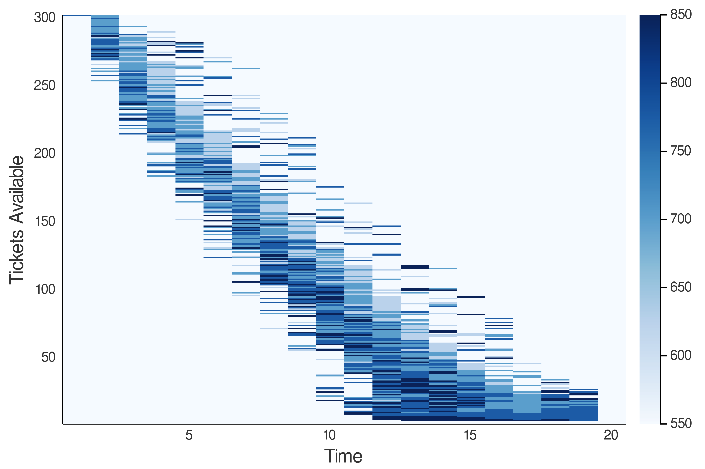

# aa-228

AA 228: Decision Making Under Uncertainty

[Final project: dynamic pricing in the airline industry using reinforcement learning](https://github.com/jonathan-ling/aa-228/tree/master/final-project)

---
> Dynamic pricing in the airline industry demonstrates some of the most effective pricing schemes in business to maximize revenue based on customers' willingness to pay for particular goods at particular times. We propose to develop a dynamic pricing reinforcement learning algorithm to maximize revenue for a single flight with multiple customer segments. We suggest reinforcement learning as it is a model-free paradigm and thus less sensitive to unusual demand patterns, and because it is a relatively new approach to dynamic pricing for airlines.

<i>Example result: pricing policies in the state space (tickets avaiable x time) using the Sarsa-Lambda algorithm. Darker blues indicate higher prices. As time progresses, we observe that in this particular scenario, high prices are sustainable with high demand, which the algorithm quickly learns to converge to.</i>

---